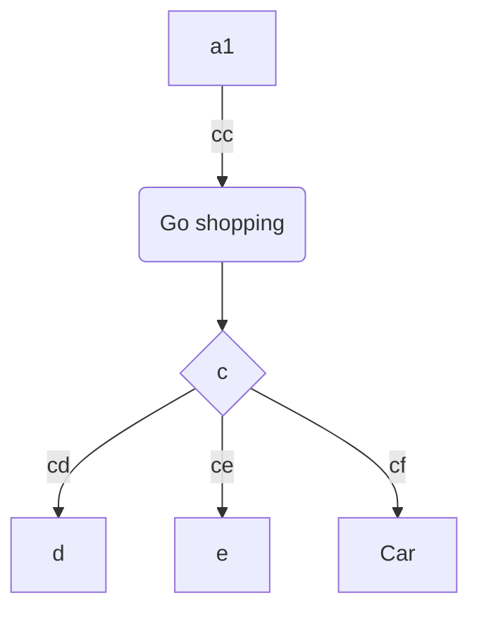
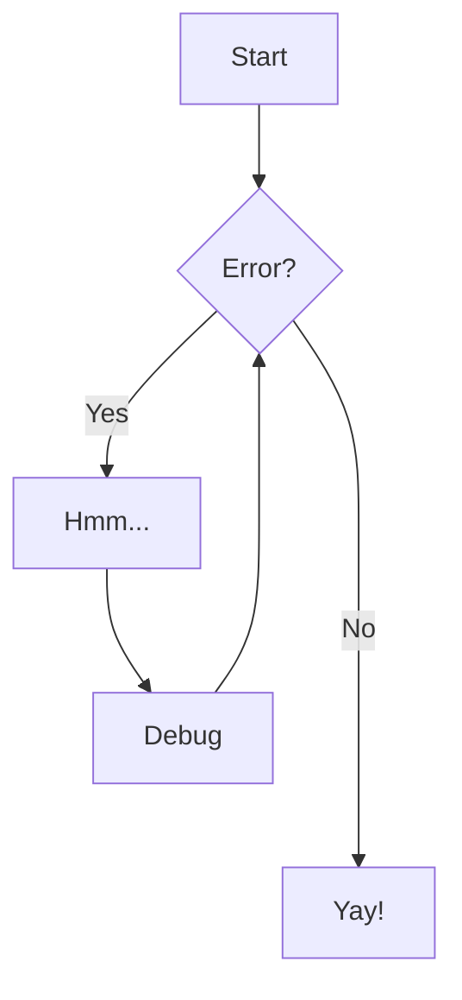

extra 额外的

exquisite：精致的 优美的

exact：确切的



```mermaid
flowchart TD
    A[a1] -->|cc| B(Go shopping)
    B --> C{c}
    C -->|cd| D[d]
    C -->|ce| E[e]
    C -->|cf| F[Car]
```



``` mermaid
flowchart TD
  A[Start] --> B{Error?};
  B -->|Yes| C[Hmm...];
  C --> D[Debug];
  D --> B;
  B ---->|No| E[Yay!];
```


``` go title="bubble_sort.py" linenums="1"
package main

func main() {
  
}
```


